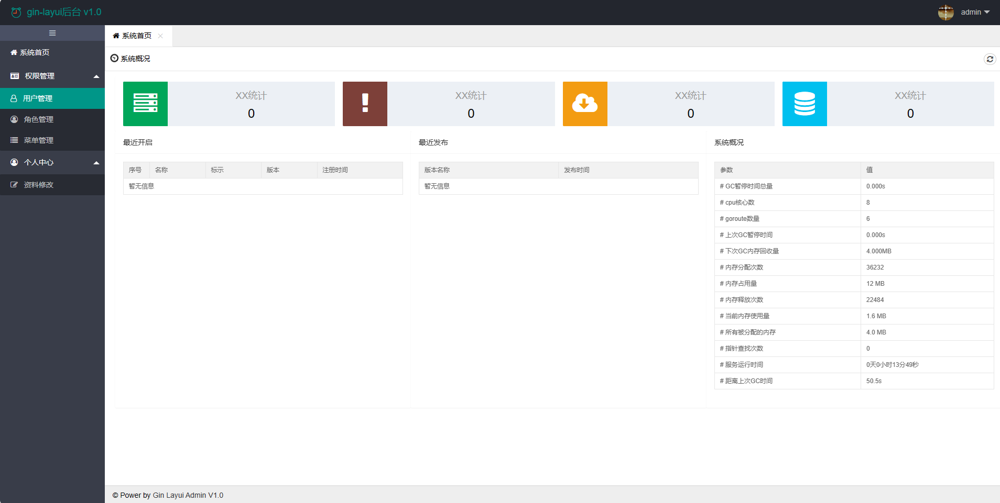

# gin-layui后台管理系统

本项目是一个带有角色和菜单权限管理功能的后台管理系统，使用了 Go 的 Gin 框架作为后端，前端使用了 Layui 框架，并结合 Gorm 实现了快速开发后台管理系统的功能。

## 安装
推荐使用 `golang 1.12` 及以上的版本编译。

编译命令：`go build -v -x` 或者 `go build -ldflags "-w -s"`(生成的可执行文件小一点，因为删除了一些调试信息)


## 初始化
建库，库名：gin-layui-admin
导入sql脚本：gin-layui-admin.sql

>管理员账号：admin，密码：123456

## 运行

```
nohup ./gin-layui-admin > runtime.log &
```

## 参考
本项目前端参考[该项目](https://github.com/george518/PPGo_ApiAdmin)。

## 截图

